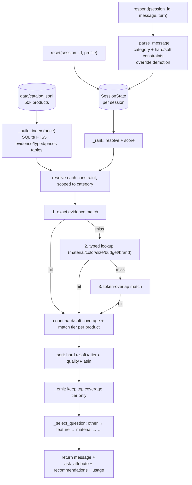

# Agent Architecture (minimal)

```mermaid
flowchart TD
    Catalog[(data/catalog.jsonl<br/>50k products)] --> Build["_build_index (once)<br/>SQLite FTS5 + evidence/typed/prices tables"]

    Profile["reset(session_id, profile)"] --> State[(SessionState<br/>per session)]

    Message["respond(session_id, message, turn)"] --> Parse["_parse_message<br/>category + hard/soft constraints<br/>override demotion"]
    Parse --> State

    State --> Rank["_rank: resolve + score"]
    Build --> Resolve

    Rank --> Resolve["resolve each constraint, scoped to category"]
    Resolve --> R1["1. exact evidence match"]
    R1 -- "miss" --> R2["2. typed lookup (material/color/size/budget/brand)"]
    R2 -- "miss" --> R3["3. token-overlap match"]
    R1 -- "hit" --> Count
    R2 -- "hit" --> Count
    R3 -- "hit" --> Count

    Count["count hard/soft coverage + match tier per product"] --> Sort["sort: hard ▸ soft ▸ tier ▸ quality ▸ asin"]
    Sort --> Gate["_emit: keep top coverage tier only"]
    Gate --> Ask["_select_question: other → feature → material → ..."]
    Ask --> Out["return message + ask_attribute + recommendations + usage"]
```
