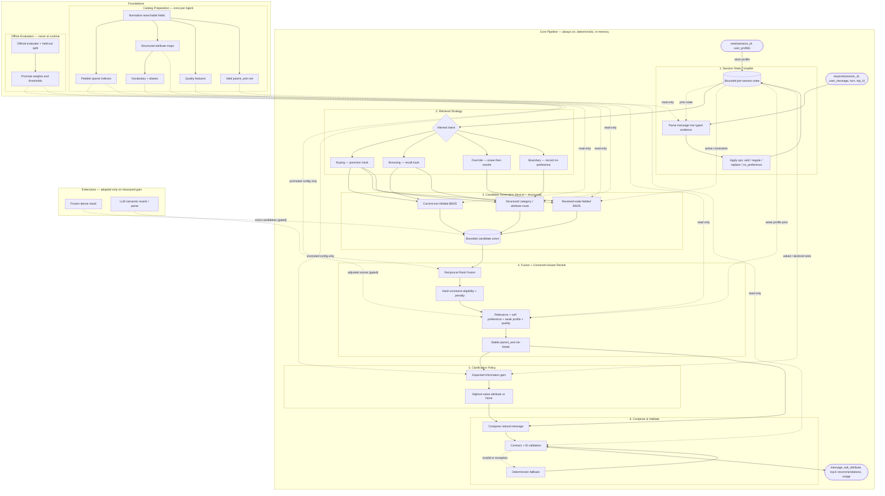

# Shopping Copilot Architecture

```mermaid
flowchart TB
    %% ===== Core pipeline =====
    subgraph CORE["Core Pipeline — always-on, deterministic, in-memory"]
        direction TB

        RESET(["reset(session_id, user_profile)"])
        ENTRY(["respond(session_id, user_message, turn, top_k)"])

        subgraph S1["1. Session State Compiler"]
            PARSE["Parse message into typed evidence"]
            OPS["Apply ops: add / negate / replace / no_preference"]
            SESSION[("Bounded per-session state")]
        end

        subgraph S2["2. Retrieval Strategy"]
            ROUTER{"Inferred intent"}
            BUY["Buying — precision track"]
            BROWSE["Browsing — recall track"]
            OVER["Override — erase then rewrite"]
            BOUND["Boundary — record no-preference"]
        end

        subgraph S3["3. Candidate Generation (lexical + structured)"]
            RCUR["Current-turn fielded BM25"]
            RSTATE["Resolved-state fielded BM25"]
            RSTRUCT["Structured category / attribute route"]
            POOL[("Bounded candidate union")]
        end

        subgraph S4["4. Fusion + Constraint-Aware Rerank"]
            FUSE["Reciprocal Rank Fusion"]
            HARD["Hard-constraint eligibility + penalty"]
            SCORE["Relevance + soft preference + weak profile + quality"]
            TIE["Stable parent_asin tie-break"]
        end

        subgraph S5["5. Clarification Policy"]
            INFO["Expected information gain"]
            ASK["Highest-value attribute or None"]
        end

        subgraph S6["6. Compose & Validate"]
            COMPOSE["Compose natural message"]
            VALID["Contract + ID validation"]
            FALLBACK["Deterministic fallback"]
        end

        RESET -->|"store profile"| SESSION
        ENTRY --> PARSE
        PARSE --> OPS
        OPS --> SESSION
        SESSION -.->|"prior state"| PARSE
        SESSION --> ROUTER
        ROUTER --> BUY
        ROUTER --> BROWSE
        ROUTER --> OVER
        ROUTER --> BOUND
        BUY --> RCUR
        BUY --> RSTATE
        BUY --> RSTRUCT
        BROWSE --> RCUR
        BROWSE --> RSTRUCT
        OVER --> RSTATE
        BOUND --> RSTRUCT
        SESSION -.->|"active constraints"| RSTATE
        RCUR --> POOL
        RSTATE --> POOL
        RSTRUCT --> POOL
        POOL --> FUSE
        FUSE --> HARD
        HARD --> SCORE
        SCORE --> TIE
        SESSION -.->|"weak profile prior"| SCORE
        TIE --> INFO
        INFO --> ASK
        SESSION -.->|"asked / declined slots"| INFO
        TIE --> COMPOSE
        ASK --> COMPOSE
        COMPOSE --> VALID
        VALID -.->|"invalid or exception"| FALLBACK
        FALLBACK --> VALID
        VALID --> OUT(["message, ask_attribute, top-k recommendations, usage"])
    end

    %% ===== Gated extensions =====
    subgraph EXT["Extensions — adopted only on measured gain"]
        RDENSE["Frozen dense recall"]
        LLMR["LLM semantic rerank / parse"]
    end
    RDENSE -.->|"extra candidates (gated)"| POOL
    LLMR -.->|"adjusted scores (gated)"| SCORE

    %% ===== Foundations =====
    subgraph FOUND["Foundations"]
        subgraph CAT["Catalog Preparation — once per Agent"]
            CNORM["Normalize searchable fields"]
            CSPARSE["Fielded sparse indexes"]
            CSTRUCT["Structured attribute maps"]
            CVOCAB["Vocabulary + aliases"]
            CQUAL["Quality features"]
            CIDS["Valid parent_asin set"]
            CNORM --> CSPARSE
            CNORM --> CSTRUCT
            CNORM --> CQUAL
            CNORM --> CIDS
            CSTRUCT --> CVOCAB
        end

        subgraph EVAL["Offline Evaluation — never at runtime"]
            EV["Official evaluator + held-out split"]
            TUNE["Promote weights and thresholds"]
        end
        EV --> TUNE
    end

    CSPARSE -.->|"read-only"| RCUR
    CSPARSE -.->|"read-only"| RSTATE
    CSTRUCT -.->|"read-only"| RSTRUCT
    CVOCAB -.->|"read-only"| PARSE
    CQUAL -.->|"read-only"| SCORE
    CIDS -.->|"read-only"| VALID
    TUNE -.->|"promoted config only"| FUSE
    TUNE -.->|"promoted config only"| INFO
```
