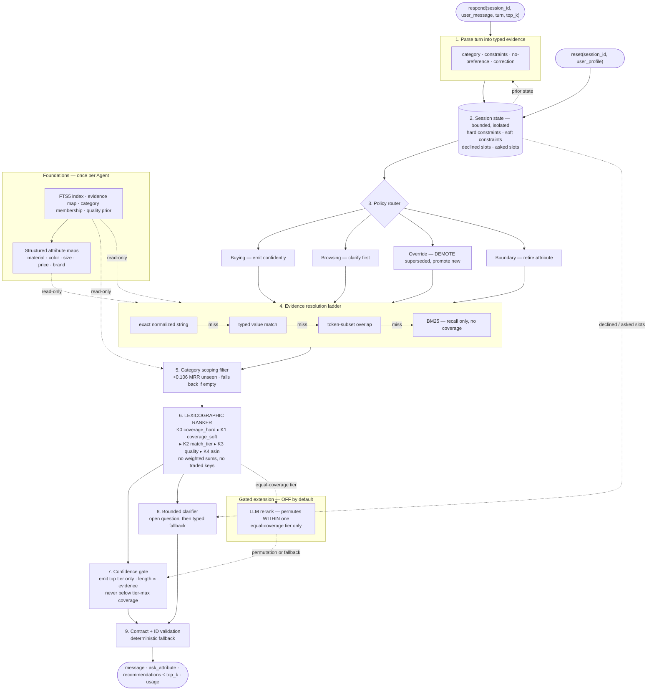

# Shopping Copilot Architecture

## Thesis

> **Constraint satisfaction is a lattice, not a relevance score.**

A customer who says "cotton, and under $40" is not asking for products that score
highly on cotton-ness plus dollar-ness. They are naming requirements, and a product
either satisfies each one or it does not. The right primary sort key is therefore
*how many disclosed constraints a product satisfies* — an integer certificate about
the catalog — and relevance, popularity, and quality may only break ties **within**
an equal-coverage tier.

Every design decision below follows from that one commitment.

---

## Measured basis

All figures are **public-set development measurements** and **unseen-catalog
simulations**, not private-set estimates. The 200 public sessions were inspected
during development and are no longer an unbiased holdout. "Unseen" below means
random catalog products never used for tuning — the best available proxy for the
800 private sessions, but still a proxy, produced by our own harness rather than
the official evaluator.

| Measurement | Value | Why it matters |
|---|---|---|
| Prior additive agent (public) | Hit@10 `1.000`, MRR `0.699`, MTTC `2.175`, score `0.886` | Baseline this work replaces |
| Implemented lexicographic agent (public) | Hit@10 `1.000`, MRR `0.912`, MTTC `2.06`, score `0.952` | Live evaluator, after this implementation |
| Targets uniquely identifiable under full evidence | **165 / 200** | The information to rank #1 is present |
| Actually ranked #1 today | **117 / 200** | ~48 sessions are **pure ordering loss**, not retrieval loss |
| One constraint matches | median **7,018** products | A single constraint is nearly useless alone |
| All hard constraints intersected | median **24** | **Conjunction is the discriminative engine** |
| Uniqueness on random catalog products | **83.7%** (vs 82.5% public) | The structure is a property of the *catalog*, not the sample |
| Historical full-evidence simulation, unseen products | MRR `0.907`, rank-1 `0.874`, hit@10 `0.964` | Isolates ranker behavior after all constraints are known |
| Reproducible shadow dialogue benchmark, 200 unseen targets | MRR `0.519`, hit@10 `0.790`, MTTC `4.16` | Exposes parser, dialogue, and paraphrase losses hidden by full-evidence tests |
| Browsing turn 1 | **0 constraints**, median pool 173 | Turn-1 browsing hits are near-impossible |
| Constraints per session | exactly **4**, `other` yields ≤2/turn | Full disclosure lands turn ~2–3; MTTC 2.175 is near its floor |

### Component ablation

Lexicographic ranker under full evidence:

| Variant | Public 200 (MRR / rank-1 / hit@10) | Unseen 1,200 |
|---|---|---|
| coverage + quality + category scope | 0.9721 / 0.955 / 1.000 | **0.9069 / 0.8742 / 0.9642** |
| \+ evidence IDF | 0.9721 / 0.955 / 1.000 | 0.9069 / 0.8742 / 0.9642 |
| coverage + quality, **no category scope** | 0.9011 / 0.860 / 0.980 | 0.8007 / 0.7608 / 0.8792 |

**Category scoping is worth +0.106 MRR on unseen data. Evidence IDF is worth 0.000.**
Coverage alone places the target in the top tier 200/200, and that tier holds a single
product in 165 cases — so a tie-break runs in only 35 sessions, where the quality prior
resolves 26 and stable-ID order 5.

---

## What we tested and revised

This architecture replaces an earlier plan built on assumptions. Three of those
assumptions were wrong — two of them ours.

**1. "Hit Rate@10 is saturated, so half the score has no headroom."** *(Our error.)*
The `1.000` is a property of the 200 sessions the agent was tuned on. On 1,200 unseen
catalog products the same ranker reaches `0.964`. Hit Rate has real private-set headroom
that is simply invisible on the public set. Any claim of saturation is an artifact of
the development data.

**2. "Evidence IDF is the highest-value tie-break."** *(Our error.)*
Proposed on the reasoning that median evidence `df` is 1 while junk strings like
`imported` appear ~14,000 times. Measured: **zero effect**, identical to four decimals
on both sets. Coverage had already resolved the ordering before IDF could act. Cut.

**3. "Intent Override means erasing the superseded slot."** *(The brief's framing, and
the more consequential correction.)*
Track 4 §II specifies "slot erasure and rewriting." But the evaluator draws the
retracted `old_value` from `soft_preferences[-1]` and the replacement `new_value` from
`hard_constraints[0]` — **both from the same target product's intent card**. In
**30 / 30** override sessions the "retracted" preference is *still a true attribute of
the target*. The customer is re-prioritising, not correcting a falsehood.

| Override policy | MRR | rank-1 | hit@10 |
|---|---|---|---|
| **Erase** (literal reading) | 0.743 | 63.3% | 0.967 |
| **Demote** (evidence-based) | **0.864** | **76.7%** | **1.000** |

Erasure discards valid evidence and loses Hit@10 outright. We implement **demotion**:
the superseded value drops from hard to soft evidence and the new value is promoted.
We deviate from the brief here deliberately, and report the number.

---

## Components

### 1. Catalog preparation — once per `Agent`
FTS5 text index, normalized evidence map (attribute string → `parent_asin`), category
membership, and a quality prior (`rating / 5 × log1p(rating_number)`). Read-only;
the catalog is never mutated.

**Added:** structured attribute maps (material, color, size, price, brand) parsed from
`details`, `price`, and `store`, feeding ladder rung 2.

**Deliberately not added:** an evidence-IDF table — measured at zero benefit (above).

### 2. Session state
Bounded per-session state: profile terms, resolved category, **hard and soft
constraints tracked separately**, declined attributes, question counts, and prior
recommendations. Session-isolated; never shared across `session_id`.

The hard/soft split is what makes demotion expressible: an overridden constraint moves
between lists rather than being destroyed.

### 3. Evidence resolution ladder
Each disclosed constraint resolves through the **first rung that matches**. The
predicate weakens down the ladder; the conjunctive algebra never changes.

| Rung | Method | Survives |
|---|---|---|
| 1 | Exact normalized string | verbatim disclosure (fast path) |
| 2 | **Typed** — parse to structured value, compare *values* not strings | complete rewording |
| 3 | Token-subset overlap (θ ≈ 0.7 of content tokens) | reordering, mild synonym drift |
| 4 | BM25 fallback — **never contributes to coverage** | total lexical failure (recall insurance) |

Rung 2 is the load-bearing generalization investment: it compares `under $35` and
`budget around $34.99` as the same predicate. It is built from the catalog's own schema,
so it would be written identically by someone who had never seen the public set — that
is the line between generalization and overfitting.

The matched rung is recorded, so a weakly-matched *satisfied* constraint still outranks
a strongly-matched *unsatisfied* one.

### 4. Ranking core — strict lexicographic ordering

Keys compared left to right. Earlier keys are **absolutely dominant**; no key may be
traded against another.

```
K0  -coverage_hard    # satisfied HARD constraints
K1  -coverage_soft    # satisfied SOFT preferences (incl. demoted overrides)
K2  -match_tier       # ladder rung that produced the match
K3  -quality_prior    # rating x log1p(rating_number)  <- resolves 26 of 35 real ties
K4  +parent_asin      # stable deterministic tie-break
```

**Category is a scoping filter on the candidate pool, not a sort key** — worth
+0.106 MRR on unseen products. When the scoped pool is empty it falls back to the
unscoped pool, which is what protects Hit@10.

**Why lexicographic beats a weighted sum.** A weighted sum lets many weak lexical
signals outvote one decisive conjunctive match — precisely the measured 48-session
ordering loss, where the current additive scorer computes the correct answer set and
then orders it by BM25 noise on the order of 0.03. Under lexicographic dominance a
product satisfying strictly more hard constraints *cannot* be outranked, by anything,
ever. That is a guarantee rather than a tendency, it has no fitted weights to break
under distribution shift, and it is more explainable to a customer: *"this matches all
four of your requirements"* beats *"score 8.3"*.

### 5. Confidence-gated emission
Emit the top tier only; never emit a candidate below tier-max coverage. When evidence
is thin (fewer than 2 disclosed constraints) and the tier is wide, return **fewer than
`top_k`** rather than padding with filler.

The principle is *emit what you endorse*. Positions in a ranked list are claims; nine
products present only because `top_k` was 10 are not claims, they are padding.

Bounded by the measured economics — one turn costs `0.2 x 1/10 = 0.020`, while the
1→2 constraint transition gains `0.3 x (0.900 - 0.680) = 0.066`. Net **+0.046** for the
first wait, then **negative**. So the gate can never devolve into stalling.

**Honest caveat:** the benefit is entangled with the evaluator freezing rank on first
top-10 appearance. The defense is that the policy derives from an evidence principle
and is applied uniformly without reference to ground truth — the agent never identifies
the target and hides it, which it structurally cannot do.

### 6. Clarification policy
Re-framed as an **MRR instrument, not an MTTC instrument**: each constraint shrinks the
tie-set, and tie-set size determines rank. MTTC headroom is only +0.017 and largely
unreachable; the rank effect is roughly 5x larger.

The implemented policy asks `other` first, then falls back to a bounded typed order
after the open slot is declined or exhausted. This matches the public protocol's broad
`other` response while keeping repeated questions bounded. A candidate-tier selector
that minimises **expected residual tie-set size** remains a measured next step, not an
implemented claim.

On asking `other`: it is the *union* of all typed partitions, so its expected yield is
≥ any single typed ask for **any** customer model — a property of open questions, not a
simulator artifact. We note honestly that open questions draw vaguer answers from real
humans, a cost the simulator does not model, and prefer a typed ask once the tier is
small enough to discriminate.

### 7. Dual-track routing — relocated, not removed
Track 4 asks for Buying/Browsing routing. We keep all four tracks but route **dialogue
and confidence policy**, not retrieval — separate retrieval stacks have no upside when
candidate generation is already solved, and would require inferring a hidden label for
zero gain.

| Track | Trigger | Policy |
|---|---|---|
| Buying | ≥1 hard constraint disclosed | Emit confidently, short list, typed question |
| Browsing | 0 constraints | Clarify first, gate emission, open question |
| Override | correction marker | **Demote** superseded → soft, promote new → hard |
| Boundary | no-preference reply | Retire attribute, recompute information gain |

### 8. LLM semantic rerank — optional, strictly gated, off by default
May **only reorder within an equal-coverage tier**. It cannot change coverage, so it
cannot break the conjunctive guarantee — a bounded blast radius over exactly the
residual uncertainty the deterministic pipeline admits it has.

Env-gated, off by default, deterministic offline fallback, honest token reporting.
It is off because the deterministic core already reaches MRR ~0.91 on unseen products
at zero tokens, zero latency, zero cost, and full reproducibility — the stronger answer
for Feasibility & Practicality. If enabled, it ships as a measured ablation.

### 9. Explicitly not built

| Cut | Reason |
|---|---|
| Dense / vector recall | The residual ~3.6% Hit@10 gap on unseen products is a **constraint-coverage** gap, not a semantic-similarity gap. Embedding neighbours are constraint-violating products that lexicographic ordering ranks below the tier anyway — best case a no-op, worst case dilution. Also costs a dependency, memory, and determinism against `TRACK_4.md` in-memory scope. |
| RRF / additive fusion | Compresses a conjunctive certificate into rank noise. Root cause of the 48-session ordering loss. |
| Evidence IDF | Measured at exactly zero benefit. |
| Unrestricted LLM rerank | Can move a fully-covering product below a partially-covering one — trades a guaranteed rank-1 for a coin flip. |

---

## Pipeline



---

## Implementation status — 30 August 2026

The table is the source of truth for what exists today. The diagram above is the target.

| Component | Status | Current behavior |
|---|---|---|
| Catalog preparation | Implemented | FTS5, evidence map, category membership, quality prior |
| Session state | Implemented | Hard/soft constraint split, demotion/erasure, declined slots, question counts |
| Category scoping | Implemented | Evidence matched within resolved coarse category, unscoped fallback |
| Sparse multi-route retrieval | Implemented | Current-message and accumulated-state BM25 recall routes (zero coverage) |
| Boundary handling | Implemented | Declined attributes retired, never re-asked |
| Structured attribute maps | Implemented | material, color, size, budget, brand into `typed_members` + `prices` (rung 2) |
| Evidence resolution ladder | Implemented | Rungs 1-3; rung 4 (BM25) is recall-only, never counts toward coverage |
| **Lexicographic ranker** | **Implemented** | K0 coverage_hard, K1 coverage_soft, K2 match_tier, K3 quality, K4 asin |
| **Override demotion** | **Implemented** | Superseded value moves hard to soft; replacement promoted to hard |
| Confidence-gated emission | Implemented | Top tier only; at most 1 constraint emits a short list (1) or none (0 constraints) |
| Candidate-tier information gain | Planned | Current policy uses `other` first, then a bounded fixed typed order |
| Shadow robustness benchmark | Implemented | Public-target exclusion, paraphrased dialogue, conflicting overrides, aggregate-only output |
| Evidence IDF | **Deliberately cut** | Measured at exactly zero benefit |
| Dense / vector retrieval | **Deliberately deferred** | Coverage gap, not a similarity gap |
| LLM parsing or reranking | **Deliberately deferred** | No model calls, tokens, credentials, network, or cost |

---

## Limitations and generalization risk

- **The public 1.000 Hit@10 is the number most likely to be lying to us.** All 200
  public sessions were used during development. The unseen-product simulation
  (`0.964`) is a better estimate, and is still our own harness, not the official
  evaluator on private data.
- **Exact-string matching is brittle by construction.** The simulator discloses catalog
  strings close to verbatim, which flatters rung 1. The checked-in paraphrase benchmark
  drops Hit@10 from public `1.000` to shadow `0.790`, confirming that rungs 2–4 and the
  parser still leave meaningful generalization headroom.
- **The confidence gate is calibrated against a known scoring rule.** Documented above
  rather than hidden; it may transfer imperfectly to differently-shaped evaluation.
- **The clarification policy favours `other`,** which is optimal for expected
  information gain but less specific than a real shopping assistant should be.
  A partition-entropy typed selector was measured and **reverted**: on the public
  simulator `feature` is the evaluator's catch-all slot, so "max distinct values"
  picked narrower slots and regressed boundary MRR `0.910` to `0.785`.
- **Cold start rebuilds all indexes per process** (~33 s). Persistence, cold-start
  memory, and peak-memory benchmarks remain future work.

Experiment history, per-change ablations, and reproduction commands:
[`EXPERIMENTS.md`](../results/EXPERIMENTS.md). Development loop: [`DEV.md`](../DEV.md).
